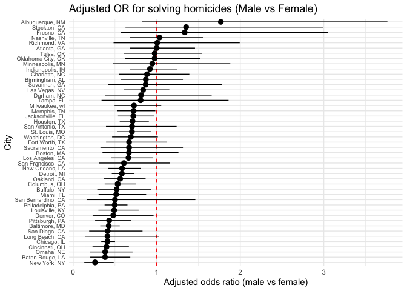
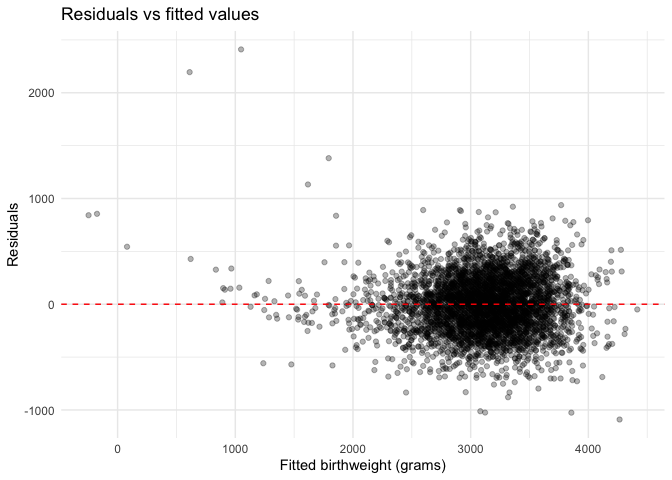

p8105_hw6_xl3054
================
Xinhui Lin (xl3054)
2025-12-03

# Problem 1

``` r
library(tidyverse)
```

    ## ── Attaching core tidyverse packages ──────────────────────── tidyverse 2.0.0 ──
    ## ✔ dplyr     1.1.4     ✔ readr     2.1.5
    ## ✔ forcats   1.0.0     ✔ stringr   1.5.1
    ## ✔ ggplot2   3.5.2     ✔ tibble    3.3.0
    ## ✔ lubridate 1.9.4     ✔ tidyr     1.3.1
    ## ✔ purrr     1.1.0     
    ## ── Conflicts ────────────────────────────────────────── tidyverse_conflicts() ──
    ## ✖ dplyr::filter() masks stats::filter()
    ## ✖ dplyr::lag()    masks stats::lag()
    ## ℹ Use the conflicted package (<http://conflicted.r-lib.org/>) to force all conflicts to become errors

``` r
homicide = read_csv("data/homicide-data.csv") %>% 
  janitor::clean_names() %>%
  mutate(city_state = paste0(city, ", ", state),
         solved_bin = ifelse(disposition == "Closed by arrest", 1, 0),
         victim_age = ifelse(victim_age %in% c("Unknown", ""), NA, victim_age),
         victim_age = as.numeric(victim_age),
         victim_sex  = factor(victim_sex, levels = c("Female", "Male")),
         victim_race = factor(victim_race)) %>% 
  filter(!(city_state %in% c("Dallas, TX", "Phoenix, AZ", "Kansas City, MO", "Tulsa, AL")),
         victim_race %in% c("White", "Black"))
```

    ## Rows: 52179 Columns: 12
    ## ── Column specification ────────────────────────────────────────────────────────
    ## Delimiter: ","
    ## chr (9): uid, victim_last, victim_first, victim_race, victim_age, victim_sex...
    ## dbl (3): reported_date, lat, lon
    ## 
    ## ℹ Use `spec()` to retrieve the full column specification for this data.
    ## ℹ Specify the column types or set `show_col_types = FALSE` to quiet this message.

``` r
homicide %>% 
  glm(solved_bin ~ victim_age + victim_sex + victim_race, 
      data = . , family = binomial) %>% 
  broom::tidy(conf.int = TRUE, exponentiate = TRUE) %>% 
  filter(term == "victim_sexMale") %>% 
  select(term, estimate, conf.low, conf.high) %>% 
  knitr::kable(digits = 4)
```

| term           | estimate | conf.low | conf.high |
|:---------------|---------:|---------:|----------:|
| victim_sexMale |   0.6028 |   0.5688 |    0.6388 |

``` r
## for each city
homicide_or = homicide %>% 
  group_by(city_state) %>% 
  nest() %>% 
  mutate(model = purrr::map(data, 
                            ~ glm(solved_bin ~ victim_age + victim_sex + victim_race,
                                  data   = .x,
                                  family = binomial)),
         tidied = purrr::map(model, ~ broom::tidy(.x, conf.int = TRUE, exponentiate = TRUE))) %>% 
  unnest(tidied) %>% 
  filter(term == "victim_sexMale") %>% 
  select(city_state, term, estimate, conf.low,conf.high) %>% 
  arrange(desc(estimate))

homicide_or %>% 
  knitr::kable(digits = 4)
```

| city_state         | term           | estimate | conf.low | conf.high |
|:-------------------|:---------------|---------:|---------:|----------:|
| Albuquerque, NM    | victim_sexMale |   1.7675 |   0.8247 |    3.7619 |
| Stockton, CA       | victim_sexMale |   1.3517 |   0.6256 |    2.9941 |
| Fresno, CA         | victim_sexMale |   1.3352 |   0.5673 |    3.0475 |
| Nashville, TN      | victim_sexMale |   1.0342 |   0.6807 |    1.5560 |
| Richmond, VA       | victim_sexMale |   1.0061 |   0.4835 |    1.9936 |
| Atlanta, GA        | victim_sexMale |   1.0001 |   0.6803 |    1.4583 |
| Tulsa, OK          | victim_sexMale |   0.9758 |   0.6091 |    1.5439 |
| Oklahoma City, OK  | victim_sexMale |   0.9741 |   0.6229 |    1.5200 |
| Minneapolis, MN    | victim_sexMale |   0.9470 |   0.4759 |    1.8810 |
| Indianapolis, IN   | victim_sexMale |   0.9187 |   0.6785 |    1.2413 |
| Charlotte, NC      | victim_sexMale |   0.8839 |   0.5507 |    1.3906 |
| Birmingham, AL     | victim_sexMale |   0.8700 |   0.5714 |    1.3138 |
| Savannah, GA       | victim_sexMale |   0.8670 |   0.4186 |    1.7802 |
| Las Vegas, NV      | victim_sexMale |   0.8373 |   0.6059 |    1.1511 |
| Durham, NC         | victim_sexMale |   0.8124 |   0.3824 |    1.6580 |
| Tampa, FL          | victim_sexMale |   0.8077 |   0.3395 |    1.8599 |
| Milwaukee, wI      | victim_sexMale |   0.7271 |   0.4951 |    1.0542 |
| Memphis, TN        | victim_sexMale |   0.7232 |   0.5261 |    0.9836 |
| Jacksonville, FL   | victim_sexMale |   0.7198 |   0.5359 |    0.9651 |
| Houston, TX        | victim_sexMale |   0.7110 |   0.5570 |    0.9057 |
| San Antonio, TX    | victim_sexMale |   0.7046 |   0.3928 |    1.2383 |
| St. Louis, MO      | victim_sexMale |   0.7032 |   0.5299 |    0.9319 |
| Washington, DC     | victim_sexMale |   0.6910 |   0.4660 |    1.0135 |
| Fort Worth, TX     | victim_sexMale |   0.6690 |   0.3935 |    1.1212 |
| Sacramento, CA     | victim_sexMale |   0.6688 |   0.3263 |    1.3144 |
| Boston, MA         | victim_sexMale |   0.6673 |   0.3508 |    1.2600 |
| Los Angeles, CA    | victim_sexMale |   0.6619 |   0.4565 |    0.9541 |
| San Francisco, CA  | victim_sexMale |   0.6075 |   0.3117 |    1.1551 |
| New Orleans, LA    | victim_sexMale |   0.5849 |   0.4219 |    0.8122 |
| Detroit, MI        | victim_sexMale |   0.5823 |   0.4619 |    0.7335 |
| Oakland, CA        | victim_sexMale |   0.5631 |   0.3637 |    0.8671 |
| Columbus, OH       | victim_sexMale |   0.5325 |   0.3770 |    0.7479 |
| Buffalo, NY        | victim_sexMale |   0.5206 |   0.2884 |    0.9358 |
| Miami, FL          | victim_sexMale |   0.5152 |   0.3040 |    0.8734 |
| San Bernardino, CA | victim_sexMale |   0.5003 |   0.1655 |    1.4624 |
| Philadelphia, PA   | victim_sexMale |   0.4963 |   0.3760 |    0.6499 |
| Louisville, KY     | victim_sexMale |   0.4906 |   0.3015 |    0.7836 |
| Denver, CO         | victim_sexMale |   0.4791 |   0.2327 |    0.9625 |
| Pittsburgh, PA     | victim_sexMale |   0.4308 |   0.2626 |    0.6956 |
| Baltimore, MD      | victim_sexMale |   0.4255 |   0.3242 |    0.5576 |
| San Diego, CA      | victim_sexMale |   0.4130 |   0.1914 |    0.8302 |
| Long Beach, CA     | victim_sexMale |   0.4102 |   0.1427 |    1.0242 |
| Chicago, IL        | victim_sexMale |   0.4101 |   0.3361 |    0.5009 |
| Cincinnati, OH     | victim_sexMale |   0.3998 |   0.2314 |    0.6670 |
| Omaha, NE          | victim_sexMale |   0.3825 |   0.1988 |    0.7109 |
| Baton Rouge, LA    | victim_sexMale |   0.3814 |   0.2043 |    0.6836 |
| New York, NY       | victim_sexMale |   0.2624 |   0.1328 |    0.4850 |

``` r
homicide_or %>% 
  ggplot(aes(x = reorder(city_state, estimate), y = estimate)) +
  geom_hline(yintercept = 1, linetype = "dashed", color = "red") +
  geom_pointrange(aes(ymin = conf.low, ymax = conf.high)) +
  coord_flip() +
  labs(x = "City", y = "Adjusted odds ratio (male vs female)",
       title = "Adjusted OR for solving homicides (Male vs Female)") +
  theme_minimal() +
  theme(axis.text.y = element_text(size = 7))
```

<!-- -->

# Problem 2

``` r
library(p8105.datasets)
data("weather_df")

set.seed(123)

boot_once = function(data) {
  boot_df = data %>% 
    sample_frac(size = 1, replace = TRUE)
    fit = lm(tmax ~ tmin + prcp, data = boot_df)
    r2_hat = broom::glance(fit)$r.squared
    coef_df = broom::tidy(fit)
    beta1 = coef_df$estimate[coef_df$term == "tmin"]
    beta2 = coef_df$estimate[coef_df$term == "prcp"]
    ratio = beta1 / beta2
    tibble(r2 = r2_hat, ratio = ratio)
}

boot_res = map_dfr(1:5000, ~boot_once(weather_df))

boot_res %>%
  pivot_longer(everything()) %>%
  ggplot(aes(value)) +
  geom_density() +
  facet_wrap(~name, scales = "free") +
  labs(title = "Bootstrap distributions of r^2 and Beta1/Beta2")
```

<!-- -->

The bootstrap distribution of $\hat{r^2}$ is kind of tight and almost
symmetric, centered around 0.942. This means that the fitted model
consistently explains a large amount of the variation in `tmax`, and the
estimated $\hat{r^2}$ does not change much across different bootstrap
samples.

The ratio $\frac{\hat{\beta_1}}{\hat{\beta_2}}$ compares the effect of
minimum temperature relative to the effect of precipitation. However,
because the precipitation coefficient is very small and close to zero,
this ratio becomes very unstable. As a result, the bootstrap
distribution is wide, heavily skewed, and has a long tail toward large
negative values. This makes the ratio hard to interpret and less
reliable than the estimate of $\hat{r^2}$.

``` r
ci_r2 = quantile(boot_res$r2, probs = c(0.025, 0.975))
ci_ratio = quantile(boot_res$ratio, probs = c(0.025, 0.975))

tibble(parameter = c("r^2", "beta1 / beta2"),
       lower = c(ci_r2[1], ci_ratio[1]),
       upper = c(ci_r2[2], ci_ratio[2])) %>% 
  knitr::kable(digits = 4, caption = "95% Bootstrap Confidence Intervals")
```

| parameter     |     lower |     upper |
|:--------------|----------:|----------:|
| r^2           |    0.9343 |    0.9466 |
| beta1 / beta2 | -279.2530 | -125.2792 |

95% Bootstrap Confidence Intervals

# Problem 3

``` r
birthweight = read_csv("data/birthweight.csv") %>% 
  janitor::clean_names() %>% 
  mutate(babysex = factor(babysex, levels = c(1, 2),
                          labels = c("male", "female")),
         frace = factor(frace, levels = c(1, 2, 3, 4, 8, 9),
                        labels = c("White", "Black", "Asian", 
                                   "Puerto Rican", "Other", "Unknown")),
         mrace = factor(mrace, levels = c(1, 2, 3, 4, 8),
                        labels = c("White", "Black", "Asian", "Puerto Rican", "Other")),
         malform = factor(malform, levels = c(0, 1), 
                          labels = c("absent", "present")))
```

    ## Rows: 4342 Columns: 20
    ## ── Column specification ────────────────────────────────────────────────────────
    ## Delimiter: ","
    ## dbl (20): babysex, bhead, blength, bwt, delwt, fincome, frace, gaweeks, malf...
    ## 
    ## ℹ Use `spec()` to retrieve the full column specification for this data.
    ## ℹ Specify the column types or set `show_col_types = FALSE` to quiet this message.

``` r
birthweight %>% summarize(across(everything(), ~ sum(is.na(.))))
```

    ## # A tibble: 1 × 20
    ##   babysex bhead blength   bwt delwt fincome frace gaweeks malform menarche
    ##     <int> <int>   <int> <int> <int>   <int> <int>   <int>   <int>    <int>
    ## 1       0     0       0     0     0       0     0       0       0        0
    ## # ℹ 10 more variables: mheight <int>, momage <int>, mrace <int>, parity <int>,
    ## #   pnumlbw <int>, pnumsga <int>, ppbmi <int>, ppwt <int>, smoken <int>,
    ## #   wtgain <int>

``` r
bw_model = lm(bwt ~ babysex + bhead + blength + gaweeks + wtgain + mheight + momage + mrace + ppbmi, data = birthweight)
summary(bw_model)
```

    ## 
    ## Call:
    ## lm(formula = bwt ~ babysex + bhead + blength + gaweeks + wtgain + 
    ##     mheight + momage + mrace + ppbmi, data = birthweight)
    ## 
    ## Residuals:
    ##      Min       1Q   Median       3Q      Max 
    ## -1090.23  -183.38    -4.46   176.95  2409.88 
    ## 
    ## Coefficients:
    ##                     Estimate Std. Error t value Pr(>|t|)    
    ## (Intercept)       -6542.7977   137.4869 -47.589  < 2e-16 ***
    ## babysexfemale        32.5916     8.5182   3.826 0.000132 ***
    ## bhead               132.9825     3.4666  38.361  < 2e-16 ***
    ## blength              76.2022     2.0279  37.577  < 2e-16 ***
    ## gaweeks              10.8118     1.4703   7.353 2.30e-13 ***
    ## wtgain                3.9714     0.3965  10.016  < 2e-16 ***
    ## mheight              11.5393     1.6563   6.967 3.73e-12 ***
    ## momage                1.1747     1.1784   0.997 0.318893    
    ## mraceBlack         -121.7809     9.4916 -12.830  < 2e-16 ***
    ## mraceAsian          -58.2906    42.8696  -1.360 0.173990    
    ## mracePuerto Rican   -90.3611    19.2605  -4.692 2.80e-06 ***
    ## ppbmi                 7.6018     1.3560   5.606 2.20e-08 ***
    ## ---
    ## Signif. codes:  0 '***' 0.001 '**' 0.01 '*' 0.05 '.' 0.1 ' ' 1
    ## 
    ## Residual standard error: 274.7 on 4330 degrees of freedom
    ## Multiple R-squared:  0.7131, Adjusted R-squared:  0.7123 
    ## F-statistic: 978.3 on 11 and 4330 DF,  p-value: < 2.2e-16

I proposed a regression model that includes the predictors `babysex`,
`bhead`, `blength`, `gaweeks`, `wtgain`, `mheight`, `momage`, `mrace`,
and `ppbmi`. This model incorporates both infant characteristics and
maternal factors that are biologically relevant to birthweight. Baby’s
head circumference, height, gestational age, and sex are the primary and
most direct indicators of a baby’s size and development at birth. The
height, weight gain, and BMI of the mother reflect nutritional status
and overall growth environment for the baby, which may also influence
the baby’s birthweight. In addition, I also added the mother’s age and
race in the model to capture any potential demographic differences that
could have an effect on birth outcomes.

``` r
library(modelr)
birthweight %>% 
  add_predictions(bw_model) %>%
  add_residuals(bw_model) %>% 
  ggplot(aes(x = pred, y = resid)) +
  geom_point(alpha = 0.3) +
  geom_hline(yintercept = 0, linetype = "dashed", color = "red") +
  labs(x = "Fitted birthweight (grams)", y = "Residuals",
       title = "Residuals vs fitted values") +
  theme_minimal()
```

<!-- -->

``` r
# Cross validation
set.seed(123)

cv_df = crossv_mc(birthweight, n = 100, test = 0.2) %>%
  mutate(train = map(train, as_tibble),
         test  = map(test,  as_tibble))

cv_models = cv_df %>% 
  mutate(model_prop = map(train, 
                        ~ lm(bwt ~ babysex + bhead + blength + gaweeks + 
                               wtgain + mheight + momage + mrace + ppbmi,
                             data = .x)),
         model_main = map(train, ~ lm(bwt ~ blength + gaweeks, data = .x)),
         model_int = map(train, ~ lm(bwt ~ bhead * blength * babysex, data = .x)))

rmse_calc = function(model, test_df) {
  preds = predict(model, newdata = test_df)
  sqrt(mean((test_df$bwt - preds)^2))
}

cv_results = cv_models %>%
  mutate(rmse_new   = map2_dbl(model_prop,   test, rmse_calc),
         rmse_main  = map2_dbl(model_main,  test, rmse_calc),
         rmse_int  = map2_dbl(model_int,  test, rmse_calc))

cv_results %>%
  summarize(mean_rmse_new  = mean(rmse_new),
            mean_rmse_main = mean(rmse_main),
            mean_rmse_int = mean(rmse_int))
```

    ## # A tibble: 1 × 3
    ##   mean_rmse_new mean_rmse_main mean_rmse_int
    ##           <dbl>          <dbl>         <dbl>
    ## 1          276.           331.          288.
